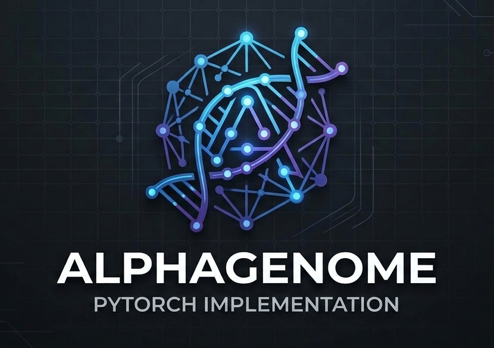
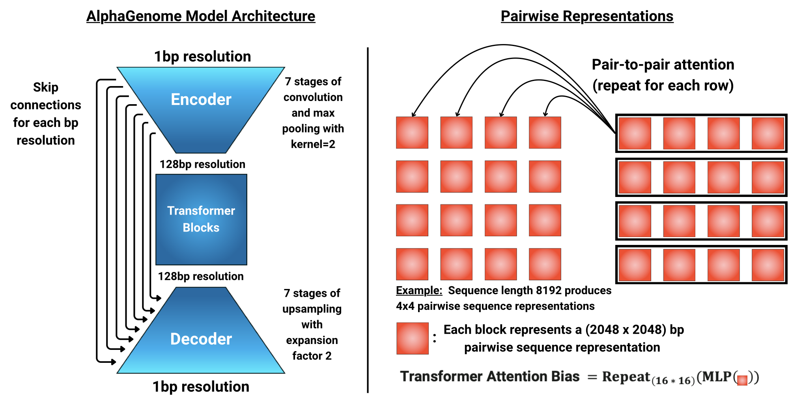
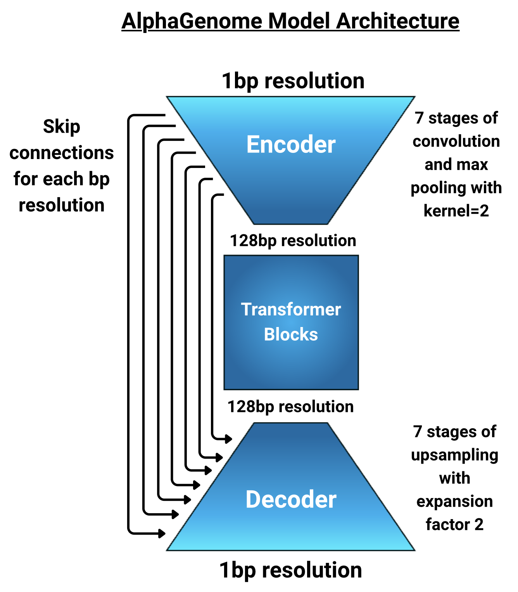

# AlphaGenome_PyTorch
<p align="left">
  
</p>
<!-- <p align="left">
  
</p> -->
<!-- <p align="left">
  
</p> -->


## Docs
The `docs` directory contains instructions on environment setup, explanations of the data structure and model architecture, and running examples. It's strongly recommended to read the `model.md` and `data.md` markdown files in the `*/AlphaGenome_PyTorch/docs/guides` directory before running examples so that you can understand why the metadata and dummy data are structured the way they are.

### Quick Start
Very easy quick start to get embeddings:
```
import torch, random
from alphagenome_pt import AlphaGenome, AlphaGenomeConfig, DataBatch, SequenceEncoder
S = 2048
metadata = {'organisms': ['human', 'mouse']}
model_cfg = AlphaGenomeConfig(input_seq_len=S, num_channels=96, metadata=metadata)
model = AlphaGenome(model_cfg)
seq_encoder = SequenceEncoder()
dna_sequence = seq_encoder.encode("".join(random.choices("ACGT", k=S)))
data = DataBatch(dna_sequence=dna_sequence, organism_index=torch.tensor([0]))
predictions, embeddings = model(data)
print(embeddings.embeddings_1bp.shape, embeddings.embeddings_1bp.shape, embeddings.embeddings_pair.shape)
```

### Environment
See `*/AlphaGenome_PyTorch/docs/environment` for instructions on how to set up a UV environment to run AlphaGenome_PyTorch.

### Guides
See `*/AlphaGenome_PyTorch/docs/guides` for explanations on the AlphaGenome model and its data structure (very helpful for understanding examples).

### Examples
See `*/AlphaGenome_PyTorch/docs/examples` for examples of:
- Masked Language Modeling (MLM) training (`train_mlm.py`)
- Training on Downstream Tasks (RNA-Seq, CAGE, ATAC, Splice Sites Classification/Usage/Junction) (`train_downstream.py`)
- MLM Pretraining --> Training on Downstream Tasks (`train_downstream_from_pretrained.py`)


## Licensing
This repository is a reimplementation of the AlphaGenome model in PyTorch, with an added option for Masked Language Modeling (MLM).

Within the `alphagenome_pt` directory, some components are direct ports of the released AlphaGenome code [Link1](https://github.com/google-deepmind/alphagenome) [Link2](https://github.com/google-deepmind/alphagenome_research) (licensed under [Apache License 2.0](https://www.apache.org/licenses/LICENSE-2.0)), some are reimplementations based on pseudocode from the [BioArXiV paper](https://www.biorxiv.org/content/10.1101/2025.06.25.661532v1), and others are original additions (e.g., the MLM head). Attribution is made clear at the top of each file in the `alphagenome_pt` directory. The `docs` and `tests` directories are original work (with LLM coding assistance).


## Intended Audience
This intended audience of this repo is model trainers: those who might want to take the AlphaGenome architecture and train it in a way that gives them some flexibility over hyperparameters, and/or do the training in PyTorch rather than Jax. If you can prepare a batch of tensor data and set up a train/val/test loop, but don't want the hassle of making sure every linear layer and norm is placed correctly while replicating the architecture, then this repo is for you. The added MLM pretraining head is also a plus.


## Other Implementations
There is another AlphaGenome PyTorch implementation out [here](https://pypi.org/project/alphagenome-pytorch/0.2.8/#description) by Phillip Wang (a.k.a. LucidRains) which is quite good. The GitHub page is down as of March 2nd, 2026, but the PyPi package remains. The main advantages of that implementation (as of version 0.2.8) are in evaluation (loading the published weights and running variant scoring). The main advantage of this implementation is research training (an MLM head and track masks that can vary by batch in training). This implementation also has a `.loss()` function in the model to compute multi-resolution losses for you, and one head per task with dense weight tensor of shape [O, D, T] rather than separate weights tensors of shape [D, T] for each [organism x task], which is mathematically equivalent but more in-line with the original AlphaGenome implementation.


## Reaching Out
Want a new feature or find a bug? Feel free to leave an issue on the GitHub repository.
