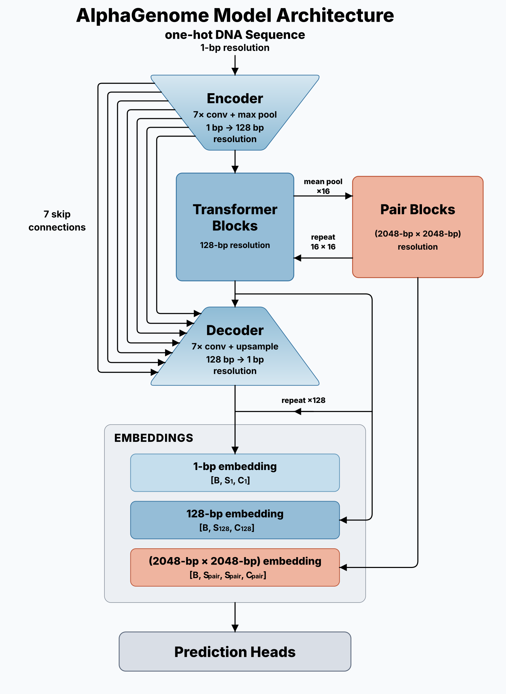
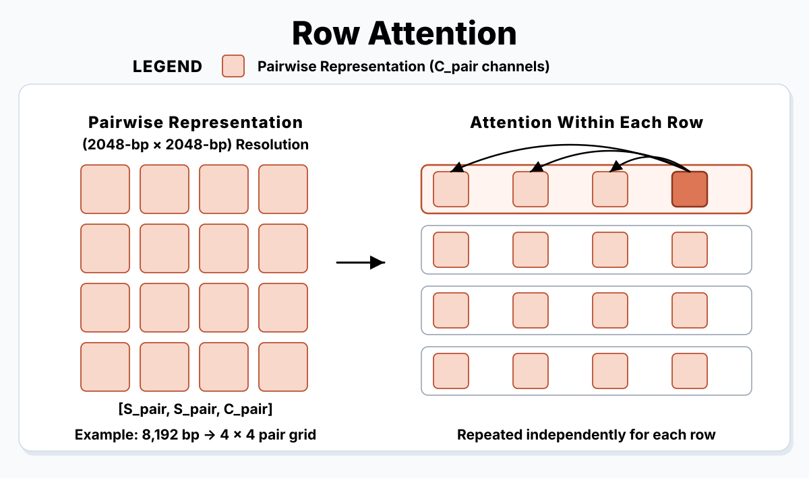
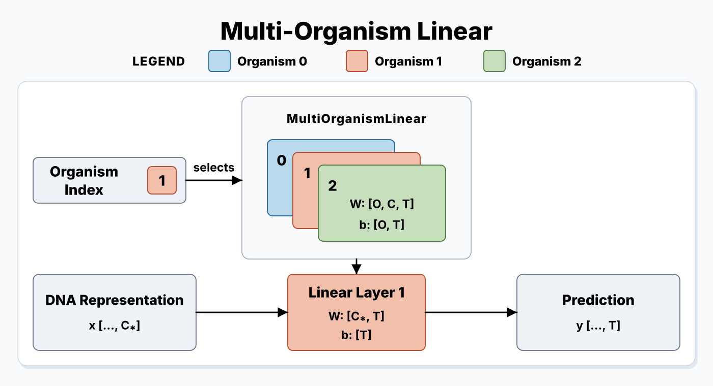

# Model Architecture

AlphaGenome is a long-context DNA language model with single-base-pair tokenization.

*Figure 1. AlphaGenome model architecture.*

## Shape Notation

:::{container} long-table

| Symbol | Meaning | Definition | Published Value |
| :---: | --- | --- | --- |
| $\mathrm{B}$ | Batch Size | Model input | Input-dependent |
| $\mathrm{S}_1$ | 1-bp Sequence Length | Model input | Up to 1,048,576 |
| $\mathrm{S}_{128}$ | 128-bp Sequence Length | $\mathrm{S}_1 / 128$ | Up to 8,192 |
| $\mathrm{S}_{\mathrm{pair}}$ | Pair-Grid Side Length | $\mathrm{S}_{128} / 16 = \mathrm{S}_1 / 2048$ | Up to 512 |
| $\mathrm{C}$ | Base Num Channels | `num_channels` | 768 |
| $\mathrm{I}$ | Channel Increment | `channel_increment` | 128 |
| $\mathrm{R}$ | Output Embedder MLP Ratio | `embedder_mlp_ratio` | 2 |
| $\mathrm{C}_1$ | 1-bp Embedding Channels | $\mathrm{C} \times \mathrm{R}$ | 1,536 |
| $\mathrm{C}_{128}$ | 128-bp Embedding Channels | $(\mathrm{C} + 6\mathrm{I}) \times \mathrm{R}$ | 3,072 |
| $\mathrm{C}_{\mathrm{pair}}$ | Pair Embedding Channels | `pair_channels` | 128 |
| $\mathrm{C}_{\mathrm{splice}}$ | Splice-Junction Latent Channels | `splice_site_channels` | 768 |
| $\mathrm{C}_{\ast}$ | Head Input Channels | $\mathrm{C}_1$, $\mathrm{C}_{128}$, or $\mathrm{C}_{\mathrm{pair}}$ | Head-dependent |
| $\mathrm{O}$ | Num Organisms | Model metadata | 2 |
| $\mathrm{T}$ | Head Output Size | Head metadata | Head-dependent |
| $\mathrm{U}$ | Num Splice-Junction Tissues | Head metadata | Head-dependent |
| $\mathrm{K}$ | Num Splice Candidates | Supplied positions width or `num_splice_sites` when generated | 512 when generated |

:::

## Overview

### Model Trunk

The trunk applies three components in succession (see <a href="#figure-model-trunk">Figure 1</a>):

1. **Encoder:** Seven stages of convolution and pooling learn local relationships and coarsen the sequence from 1-bp to 128-bp resolution.
2. **Transformer (+ Pair) Blocks:** Transformer blocks exchange global information between 128-bp resolution tokens. Pair blocks update pairwise (2,048-bp &times; 2,048-bp) representations, which determine the attention bias for the transformer blocks.
3. **Decoder:** Seven stages of convolution and upsampling further learn local relationships and refine the sequence from 128-bp resolution to its original 1-bp resolution. Each stage is combined with a resolution-matched skip connection from the encoder to preserve the original fine-grained information.

The trunk results in three embeddings:

| Embedding | Representation | Shape |
| --- | --- | --- |
| `embeddings_1bp` | Sequence &middot; 1-bp | $[\mathrm{B}, \mathrm{S}_1, \mathrm{C}_1]$ |
| `embeddings_128bp` | Sequence &middot; 128-bp | $[\mathrm{B}, \mathrm{S}_{128}, \mathrm{C}_{128}]$ |
| `embeddings_pair` | Pair &middot; (2,048-bp &times; 2,048-bp) | $[\mathrm{B}, \mathrm{S}_{\mathrm{pair}}, \mathrm{S}_{\mathrm{pair}}, \mathrm{C}_{\mathrm{pair}}]$ |

### Head Inputs

Metadata determines which heads are constructed and enabled. Each head reads the embedding(s) it needs:

:::{container} long-table

| Heads | Input Representation | Shape |
| --- | --- | --- |
| `atac`, `dnase`, `procap`, `cage`, `rna_seq` | Sequence &middot; 1-bp and 128-bp | $[\mathrm{B}, \mathrm{S}_1, \mathrm{C}_1]$ &rarr; $[\mathrm{B}, \mathrm{S}_1, \mathrm{T}]$ $[\mathrm{B}, \mathrm{S}_{128}, \mathrm{C}_{128}]$ &rarr; $[\mathrm{B}, \mathrm{S}_{128}, \mathrm{T}]$ |
| `chip_tf`, `chip_histone` | Sequence &middot; 128-bp | $[\mathrm{B}, \mathrm{S}_{128}, \mathrm{C}_{128}]$ &rarr; $[\mathrm{B}, \mathrm{S}_{128}, \mathrm{T}]$ |
| `contact_maps` | Pair &middot; (2,048-bp &times; 2,048-bp) | $[\mathrm{B}, \mathrm{S}_{\mathrm{pair}}, \mathrm{S}_{\mathrm{pair}}, \mathrm{C}_{\mathrm{pair}}]$ &rarr; $[\mathrm{B}, \mathrm{S}_{\mathrm{pair}}, \mathrm{S}_{\mathrm{pair}}, \mathrm{T}]$ |
| `splice_sites_classification` | Sequence &middot; 1-bp | $[\mathrm{B}, \mathrm{S}_1, \mathrm{C}_1]$ &rarr; $[\mathrm{B}, \mathrm{S}_1, 5]$ |
| `splice_sites_usage` | Sequence &middot; 1-bp | $[\mathrm{B}, \mathrm{S}_1, \mathrm{C}_1]$ &rarr; $[\mathrm{B}, \mathrm{S}_1, \mathrm{T}]$ |
| `splice_sites_junction` | Sequence &middot; Selected 1-bp Positions &rarr; Pair &middot; Donor &times; Acceptor | $[\mathrm{B}, \mathrm{S}_1, \mathrm{C}_1]$ and $[\mathrm{B}, 4, \mathrm{K}]$ &rarr; $[\mathrm{B}, \mathrm{K}, \mathrm{K}, 2\mathrm{U}]$ |
| `masked_language_modeling` | Sequence &middot; 1-bp | $[\mathrm{B}, \mathrm{S}_1, \mathrm{C}_1]$ &rarr; $[\mathrm{B}, \mathrm{S}_1, 5]$ |

:::

The genome-track heads are `atac`, `dnase`, `procap`, `cage`, `rna_seq`, `chip_tf`, and `chip_histone`.

## Component Details

### Encoder

Each encoder stage applies two convolutions, saves the resulting activation as a decoder skip connection, and pools the sequence by two.

| Stage | Resolution | Channels | Published Channels |
| :---: | :---: | :---: | ---: |
| 1 | 1 bp &rarr; 2 bp | $4$ &rarr; $\mathrm{C}$ | 4 &rarr; 768 |
| 2 | 2 bp &rarr; 4 bp | $\mathrm{C}$ &rarr; $\mathrm{C} + \mathrm{I}$ | 768 &rarr; 896 |
| 3 | 4 bp &rarr; 8 bp | $\mathrm{C} + \mathrm{I}$ &rarr; $\mathrm{C} + 2\mathrm{I}$ | 896 &rarr; 1,024 |
| 4 | 8 bp &rarr; 16 bp | $\mathrm{C} + 2\mathrm{I}$ &rarr; $\mathrm{C} + 3\mathrm{I}$ | 1,024 &rarr; 1,152 |
| 5 | 16 bp &rarr; 32 bp | $\mathrm{C} + 3\mathrm{I}$ &rarr; $\mathrm{C} + 4\mathrm{I}$ | 1,152 &rarr; 1,280 |
| 6 | 32 bp &rarr; 64 bp | $\mathrm{C} + 4\mathrm{I}$ &rarr; $\mathrm{C} + 5\mathrm{I}$ | 1,280 &rarr; 1,408 |
| 7 | 64 bp &rarr; 128 bp | $\mathrm{C} + 5\mathrm{I}$ &rarr; $\mathrm{C} + 6\mathrm{I}$ | 1,408 &rarr; 1,536 |

After seven stages, the encoder produces a sequence of length $\mathrm{S}_{128}$ and channel width $\mathrm{C} + 6\mathrm{I}$, with each token representing 128 base pairs.

### Transformer

The transformer learns global relationships across the 128-bp sequence
representation.

| Aspect | Description |
| --- | --- |
| Input | $\mathrm{S}_{128}$ sequence tokens at 128-bp resolution |
| Each block | Grouped-query bidirectional attention &rarr; MLP |

:::{dropdown} Published Configuration
:color: info
:icon: info

The published model configuration has 9 transformer blocks, 8 query heads, and 1 key/value head. At the published maximum sequence length, the transformer sequence contains 8,192 tokens.
:::

### Pair Blocks

Pair blocks maintain a pairwise representation of the DNA sequence that modulates attention in the transformer blocks via an attention bias. Every other transformer block, starting with the first, updates this pairwise representation before sequence attention.

A pair update performs the following operations:

1. Pool the sequence representation by 16, from 128-bp resolution to 2,048-bp resolution.
2. Construct a learned pair representation from the pooled sequence representation and add it to the pair state.
3. Apply row attention (see <a href="#figure-row-attention">Figure 2</a>) and an MLP.

*Figure 2. Row attention mixes pair representations within each row independently.*

:::{dropdown} Published Configuration
:color: info
:icon: info

The published model configuration has 5 pair updates in blocks 1, 3, 5, 7, and 9 of the transformer. At the published maximum sequence length, the pair grid has shape $512 \times 512$.
:::

:::{dropdown} Row Attention Scaling
:color: info
:icon: info

Full attention across all $\mathrm{S}_{\mathrm{pair}}^2$ pair entries scales
as $\mathcal{O}((\mathrm{S}_1 / 2048)^4)$. Restricting attention to individual
rows reduces this to $\mathcal{O}((\mathrm{S}_1 / 2048)^3)$.
:::

### Decoder

Each decoder stage applies a convolution, repeat-upsamples the sequence by two, adds the matched resolution encoder skip connection, then applies a second convolution.

| Stage | Resolution | Channels | Published Channels |
| :---: | :---: | :---: | ---: |
| 1 | 128 bp &rarr; 64 bp | $\mathrm{C} + 6\mathrm{I}$ &rarr; $\mathrm{C} + 6\mathrm{I}$ | 1,536 &rarr; 1,536 |
| 2 | 64 bp &rarr; 32 bp | $\mathrm{C} + 6\mathrm{I}$ &rarr; $\mathrm{C} + 5\mathrm{I}$ | 1,536 &rarr; 1,408 |
| 3 | 32 bp &rarr; 16 bp | $\mathrm{C} + 5\mathrm{I}$ &rarr; $\mathrm{C} + 4\mathrm{I}$ | 1,408 &rarr; 1,280 |
| 4 | 16 bp &rarr; 8 bp | $\mathrm{C} + 4\mathrm{I}$ &rarr; $\mathrm{C} + 3\mathrm{I}$ | 1,280 &rarr; 1,152 |
| 5 | 8 bp &rarr; 4 bp | $\mathrm{C} + 3\mathrm{I}$ &rarr; $\mathrm{C} + 2\mathrm{I}$ | 1,152 &rarr; 1,024 |
| 6 | 4 bp &rarr; 2 bp | $\mathrm{C} + 2\mathrm{I}$ &rarr; $\mathrm{C} + \mathrm{I}$ | 1,024 &rarr; 896 |
| 7 | 2 bp &rarr; 1 bp | $\mathrm{C} + \mathrm{I}$ &rarr; $\mathrm{C}$ | 896 &rarr; 768 |

After seven stages, the decoder returns the sequence to length $\mathrm{S}_{1}$ and channel width $\mathrm{C}$, with each token representing 1 base pair.

### Output Embedders

Output embedders map the final decoder, transformer, and pair states to the 1-bp, 128-bp, and pair embeddings, respectively. The 1-bp embedder also adds the projected 128-bp embedding as a repeated skip connection.

| Attribute | Generic Shape | Published Shape |
| --- | --- | --- |
| `embeddings_1bp` | $[\mathrm{B}, \mathrm{S}_1, \mathrm{C}_1]$ | $[\mathrm{B}, \mathrm{S}_1, 1{,}536]$ |
| `embeddings_128bp` | $[\mathrm{B}, \mathrm{S}_{128}, \mathrm{C}_{128}]$ | $[\mathrm{B}, \mathrm{S}_{128}, 3{,}072]$ |
| `embeddings_pair` | $[\mathrm{B}, \mathrm{S}_{\mathrm{pair}}, \mathrm{S}_{\mathrm{pair}}, \mathrm{C}_{\mathrm{pair}}]$ | $[\mathrm{B}, \mathrm{S}_{\mathrm{pair}}, \mathrm{S}_{\mathrm{pair}}, 128]$ |

The embedder expansion ratio applies to the 1-bp and 128-bp sequence embedders, whereas the pair embedder does not change the representation width.

## Prediction Heads

### Predictions Meaning

For most heads, each final-axis channel represents a distinct **context**, defined by a unique combination of attributes (e.g. assay, biosample, tissue, condition, or strand). Classification heads and the splice-junction strand layout are the exceptions:

| Heads | Final-Axis Meaning | Values |
| --- | --- | --- |
| Genome-track heads | Contexts | Non-negative |
| `contact_maps` | Contexts | Any real value |
| `splice_sites_usage` | Contexts | Independent probabilities in $[0, 1]$ |
| `splice_sites_classification` | Classes (Donor +, Acceptor +, Donor -, Acceptor -, other) | Categorical probabilities summing to 1 |
| `splice_sites_junction` | Tissue contexts ($\mathrm{U}$) &times; fixed strands ($2\mathrm{U}$ total): all +, then all - | Non-negative |
| `masked_language_modeling` | Classes (`ACGTN`) | Categorical probabilities summing to 1 |

Prediction tensors are padded to the largest output width across organisms, and binary metadata masks distinguish valid from padded channels for each organism. For splice junctions, the tissue mask is repeated across two stranded blocks (all positive-strand tissues, then all negative-strand tissues), which enforces structure on its final axis. See [Masks](data-and-metadata.md#masks) for metadata-mask derivation and [Target and Mask Fields](data-and-metadata.md#target-and-mask-fields) for per-batch masks.

### Predictions Scaling

Genome-track heads return both scaled and unscaled predictions:

| Output | Meaning |
| --- | --- |
| `scaled_predictions_*` | Normalized values that are directly predicted by the model |
| `predictions_*` | Values transformed back to experimental scale using metadata means and prediction resolution |

All genome-track heads use the same soft-clip transform. RNA-seq additionally
uses a power transform. The exact forward and inverse definitions are included
below for reproducing target scaling outside the model.

:::{dropdown} Exact Genome-Track Scaling Transforms
For experimental target $y$ and model prediction $\hat{y}$, let $\mu_{o,t}$ be the metadata-defined mean for organism $o$ and output track $t$, and let $r$ be the prediction resolution (1 or 128):

$$
\begin{aligned}
y_{\mathrm{scaled}} &= f\left(\frac{y}{\mu_{o,t}r}\right), \\
\hat{y} &=
f^{-1}\left(\hat{y}_{\mathrm{scaled}}\right)\mu_{o,t}r.
\end{aligned}
$$

Define the shared soft-clip transform $s$ and its inverse as:

$$
s(z) =
\begin{cases}
z, & z \le 10, \\
2\sqrt{10z} - 10, & z > 10,
\end{cases}
\qquad
s^{-1}(z) =
\begin{cases}
z, & z \le 10, \\
\dfrac{(z + 10)^2}{40}, & z > 10.
\end{cases}
$$

For every genome-track head except `rna_seq`, $f = s$. RNA-seq additionally applies a power transform before soft clipping:

$$
f(z) = s\left(z^{3/4}\right),
\qquad
f^{-1}(z) = \left(s^{-1}(z)\right)^{4/3}.
$$
:::

### Multi-Organism Linear

Most heads use a `MultiOrganismLinear` layer, which stores a separate projection for each organism that is selected by the `organism_index` (see <a href="#figure-multi-organism-linear">Figure 3</a>).

*Figure 3. The organism index selects one weight-and-bias slice for the head
projection.*

The `masked_language_modeling` head is the only exception. It uses a shared
`nn.Linear` across organisms.

## Organism-Specific Parameters and State

AlphaGenome uses organism-specific parameters and state throughout its architecture. Metadata defines the organisms and their index order.

:::{dropdown} Organism-Specific Learnable Parameters

| Tensor | Shape | Use |
| --- | --- | --- |
| `org_embedder.weight` | $[\mathrm{O}, \mathrm{C} + 6\mathrm{I}]$ | Conditions the transformer input |
| `output_t.org.weight` | $[\mathrm{O}, \mathrm{C}_{128}]$ | Conditions the 128-bp output embedding |
| `output_x.org.weight` | $[\mathrm{O}, \mathrm{C}_1]$ | Conditions the 1-bp output embedding |
| `output_pair.organism_embed.weight` | $[\mathrm{O}, \mathrm{C}_{\mathrm{pair}}]$ | Conditions the pair output embedding |
| `MultiOrganismLinear.weight`, `.bias` | $[\mathrm{O}, \mathrm{C}_{\ast}, \mathrm{T}]$, $[\mathrm{O}, \mathrm{T}]$ | Defines ordinary organism-specific head projections |
| Splice-junction `MultiOrganismLinear.weight`, `.bias` | $[\mathrm{O}, \mathrm{C}_1, \mathrm{C}_{\mathrm{splice}}]$, $[\mathrm{O}, \mathrm{C}_{\mathrm{splice}}]$ | Projects organism-specific splice-site features |
| `residual_scales[resolution]` | $[\mathrm{O}, \mathrm{T}]$ | Scales genome-track outputs at each resolution |
| `{pos/neg}_{donor/acceptor}_logits_embeddings` | $[\mathrm{O}, 2, \mathrm{U}, \mathrm{C}_{\mathrm{splice}}]$ each | Stores per-organism, per-tissue scale and offset parameters for splice-junction features |

:::

:::{dropdown} Organism-Specific State

Metadata also defines non-learned tensors used for scaling and channel availability:

| Tensor | Shape | Use |
| --- | --- | --- |
| Metadata means (`_track_means`) | $[\mathrm{O}, \mathrm{T}]$ | Scales genome-track targets and predictions |
| Track masks (`_track_mask`) | $[\mathrm{O}, \mathrm{T}]$ | Masks padded or unavailable output channels |
| Splice-junction track mask (`_track_mask`) | $[\mathrm{O}, 2\mathrm{U}]$ | Masks unavailable tissues across both strand blocks |

:::

## Computational Scaling

Ignoring channel widths and block counts, the highest-order sequence-length
scaling of each component is:

| Component | Highest-Order Scaling |
| --- | --- |
| Encoder and Decoder | $\mathcal{O}(\mathrm{S}_1)$ from convolutions, pooling, and upsampling |
| Transformer Blocks | $\mathcal{O}((\mathrm{S}_1 / 128)^2)$ from attention |
| Pair Updates | $\mathcal{O}((\mathrm{S}_1 / 2048)^3)$ from row attention |

:::{dropdown} Published-Model Scaling at Maximum Length
:color: info
:icon: info

Although row attention in the pair blocks scales cubically, quadratic terms
dominate computation through the published maximum sequence length of
1,048,576 bp when using the published configuration.
:::
