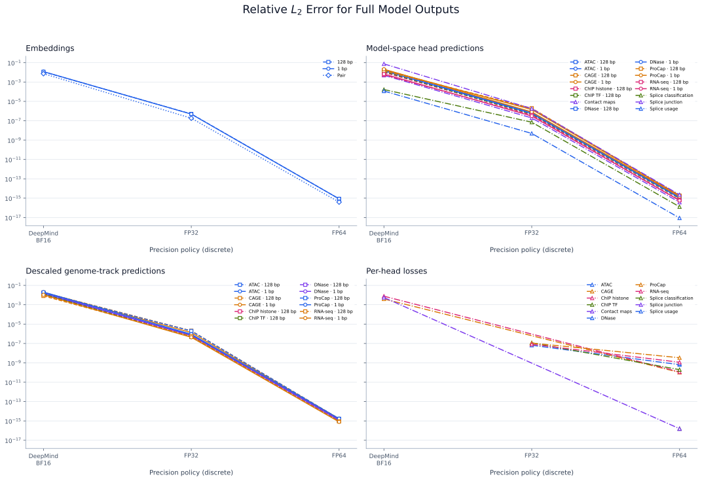
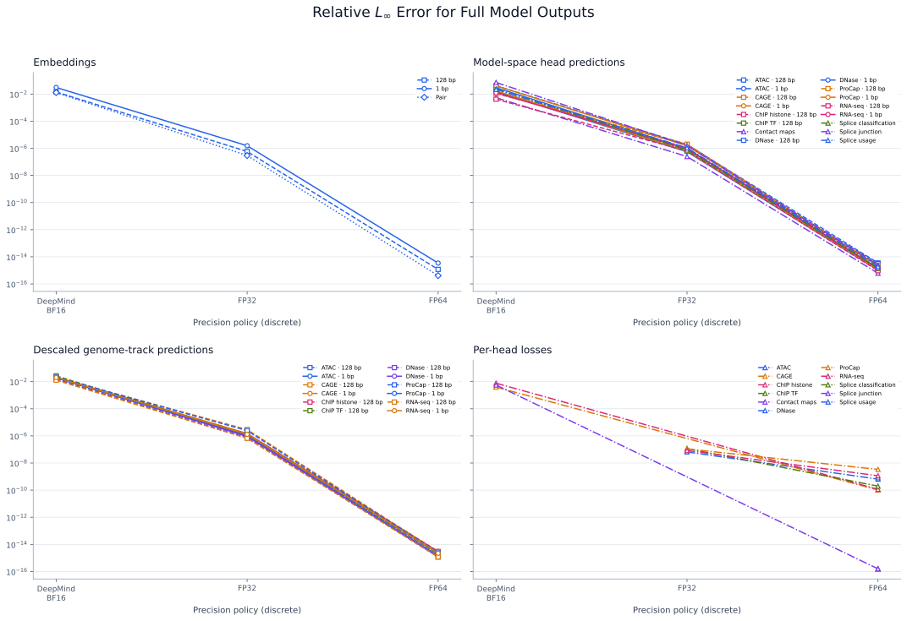
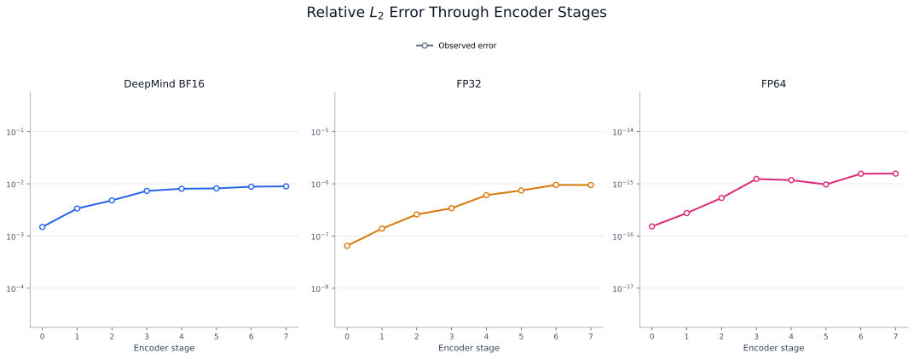
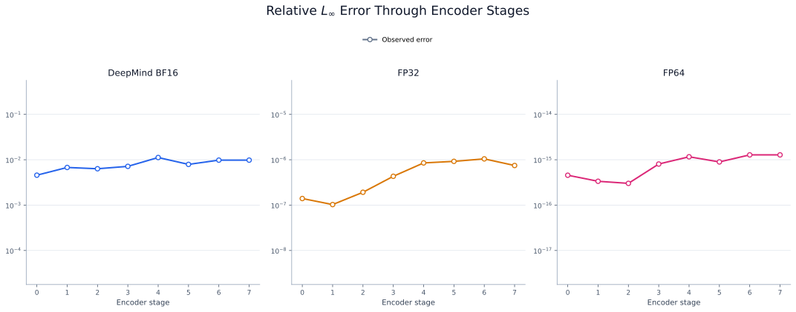

# DeepMind JAX Equivalence

AlphaGenome PyTorch is verified against the public DeepMind JAX implementation
at three levels, each satisfying explicit numerical criteria:

- **Single Module:** Core repeated operations, losses, and isolated model modules.
- **Architecture:** Higher-level modules (encoder, transformer, decoder, output embedder).
- **Full Model:** End-to-end outputs (embeddings, predictions, losses).

The full-model comparison is the strongest evidence of equivalence. We include the smaller
comparisons here as well because they helped localize differences during debugging and show
the full scope of what has been verified.

## Models and Checkpoints

| Artifact | Selection |
| --- | --- |
| JAX implementation | [`alphagenome_research` commit `1e55dcf`](https://github.com/google-deepmind/alphagenome_research/commit/1e55dcffb98ba26b31e74edc5e9f038f54c0e89d) |
| Source model state | Official JAX `all_folds` checkpoint from [`google/alphagenome-all-folds`](https://huggingface.co/google/alphagenome-all-folds) |
| Converted model state | Corresponding `alphagenome_all_folds.pt`, derived with this repository's converter and loaded from [`RylieWeaver/alphagenome-pytorch`](https://huggingface.co/RylieWeaver/alphagenome-pytorch) |

## Test Inputs

| | Full model | Checkpoint modules | Without checkpoint |
| --- | --- | --- | --- |
| Parameters | Full checkpoint | Checkpoint slices | Synthetic |
| Inputs | DNA and Organism Indices `[0, 1]` | Synthetic | Synthetic |
| Targets (as needed) | Synthetic | Synthetic | Synthetic |

The full model uses 4,096-bp synthetic DNA by default. `--equivalence-dna`
accepts one or two FASTA files to use for the full model DNA input, truncated to
`--equivalence-sequence-length`. By default, the test selects one splice site
per 2,048 bp, with a minimum of 16 and a maximum of 512, using a 0.1 prediction
threshold.

:::{dropdown} How are synthetic values constructed?
:color: info
:icon: info

Synthetic generation is deterministic. Activations generally use fixed-seed
draws from $\mathcal{N}(0,1)$. Synthetic parameters generally use evenly spaced
values within fan-in-scaled bounds similar to default PyTorch initialization,
while targets and other domain-constrained quantities use test-specific intervals.

Some operations deliberately use inputs outside these general patterns. For
example, GELU uses an evenly spaced grid over $[-4, 4]$ to cover its nonlinear
transition and both tails.

Magnitude matters because value scale can change the observed error. We don't claim
our synthetic values to be perfect, but they are chosen to avoid artificially
inflating or suppressing differences because of synthetic data scale.
:::


## Numerical Comparison

Equivalence tests run under three policies (described in [Precision and Dtype
Policies](model/configuration.md#precision-and-dtype-policies)):

- `deepmind` matches the published JAX precision policy: FP32 inputs and parameters,
  BF16 compute and outputs, and FP32 for specific upcasted operations.
- `float32` uses FP32 throughout the model.
- `float64` uses FP64 throughout the model.

The comparison thresholds for the test suite are:

| Comparison level | Representation | Metric | DeepMind | FP32 | FP64 |
| --- | --- | --- | ---: | ---: | ---: |
| Single module | Default | Relative L2 | `1e-2` | `1e-6` | `1e-8` |
|  |  | Relative L∞ | `2e-2` | `2e-6` | `2e-8` |
| Architecture | Default | Relative L2 | `2e-2` | `2e-6` | `2e-8` |
|  |  | Relative L∞ | `4e-2` | `4e-6` | `4e-8` |
| Full model | Default | Relative L2 | `5e-2` | `5e-6` | `5e-8` |
|  |  | Relative L∞ | `1e-1` | `1e-5` | `1e-7` |
| Full model | Splice-junction predictions | Relative L2 | `1.25e-1` | `1.25e-5` | `1.25e-7` |
|  |  | Relative L∞ | `2.5e-1` | `2.5e-5` | `2.5e-7` |
| Full model | Descaled predictions | Relative L2 | `1.25e-1` | `1.25e-5` | `1.25e-7` |
|  |  | Relative L∞ | `2.5e-1` | `2.5e-5` | `2.5e-7` |

:::{dropdown} How are thresholds constructed?
:color: info
:icon: info

For non-exact comparisons, the threshold is

```{math}
T = c_{\mathrm{precision}}
    c_{\mathrm{composition}}
    c_{\mathrm{metric}}
    c_{\mathrm{representation}}.
```

The coefficients are:

- **Precision:** DeepMind mixed precision = $10^{-2}$, FP32 = $10^{-6}$,
  and FP64 = $10^{-8}$.
- **Composition:** module = $1$, architecture = $2$, and full model = $5$.
- **Metric:** relative $L_2$ = $1$ and relative $L_\infty$ = $2$.
- **Representation:** default = $1$, descaled genome-track predictions =
  $2.5$, and splice-junction predictions = $2.5$.

Exact comparisons instead use a threshold of zero. We use a coefficient of
$2.5$ for descaled RNA-seq and splice-junction predictions because these
representations empirically show greater accumulated floating-point error,
particularly RNA-seq among the genome-track predictions.
:::

:::{dropdown} How are relative {math}`L_2` and {math}`L_\infty` calculated?
:color: info
:icon: info

For the finite PyTorch values $p$ and corresponding JAX reference values $j$,
the metrics are

$$
\operatorname{relative\ L2} = \frac{\lVert p-j \rVert_2}{\lVert j \rVert_2},
\qquad
\operatorname{relative\ L\infty} = \frac{\max |p-j|}{\max |j|}
$$

A zero-scale reference has relative error zero for an exact match and infinity
otherwise. An infinite relative error fails the equivalence check, ensuring that
a nonzero PyTorch result cannot pass against a zero JAX reference. Values are converted
to FP64 for these calculations. NaN and $\pm\infty$ locations must match
exactly between frameworks and are excluded from the norm calculations.
:::

:::{dropdown} How is the precision policy applied to the JAX model?
:color: info
:icon: info

The test harness applies the policy to the JAX model in two layers:

1. A Haiku mixed-precision policy controls parameter creation, runtime compute
   for parameters, state, and inputs, and returned-output dtypes.
2. `use_jax_compute_uptype_policy` temporarily intercepts precision choices
   that are hard-coded in the reference source and would otherwise override
   that policy. Across the JAX attention, head, normalization, and loss modules,
   explicit `jnp.float32` casts become `compute_uptype`. The splice-site-usage
   head's explicit `jnp.float16` output cast remains FP16 for BF16 compute and
   becomes `compute_dtype` for FP32 or FP64 compute. Fixed `BF16_BF16_F32`
   einsum algorithms are also replaced with the algorithm for the selected
   compute and accumulation dtypes.

All intercepted module bindings are restored when the comparison exits the
context manager, leaving the installed JAX package unchanged.
:::

:::{dropdown} How do the implementations differ without affecting equivalence?
:color: warning
:icon: alert

Haiku applies its mixed-precision policy at each module-method boundary. In the
JAX model, the casts follow this flow:

- `forward_trunk()` &rarr; embeddings in `output_dtype`
- `forward_heads()` &rarr; embeddings cast back to `compute_dtype` &rarr;
  predictions in `output_dtype`
- `loss()` &rarr; predictions cast back to `compute_dtype` &rarr; loss tree in
  `output_dtype`

In contrast, **PyTorch** avoids casts at those internal boundaries:

- `_embed_batch()` &rarr; embeddings remain in `compute_dtype` when passed to
  `_predict_from_embeddings()`
- `_predict_from_embeddings()` &rarr; predictions remain at their head-defined
  compute dtype when passed to `metric_tree_from_predictions()`
- `loss()` &rarr; the complete `LossOutput` is cast to `output_dtype` only when
  returned through the public API

No cast occurs when embeddings and predictions move between internal model
stages. A cast to `output_dtype` occurs only when `embed()`, `predict()`, or
`loss()` returns a final result to the caller.

For every policy used in the equivalence report, `output_dtype` equals
`compute_dtype`. Because these dtypes are identical, removing the intermediate
casts does not change the precision.
:::

:::{dropdown} Where do JAX and PyTorch precision behavior differ?
:color: danger
:icon: alert

Some framework constraints and intentional implementation choices can still
produce small numerical differences:

- **FP16 versus BF16 in splice-site usage head.** The JAX model casts the sigmoid
  prediction to FP16, which Haiku's output boundary immediately recasts to
  BF16. No computation consumes the intermediate FP16 value. Rather than add a
  one-off intermediate dtype to `DtypePolicy`, PyTorch casts the prediction
  directly to `compute_dtype`. This alters the rounding only under the `deepmind`
  policy because JAX and PyTorch both use direct FP32 and FP64 casts under the
  higher-precision policies.
- **Low-precision multiplication with higher-precision accumulation.** JAX can
  use BF16 operands with FP32 accumulation (`BF16_BF16_F32`), but PyTorch
  cannot select a separate accumulation dtype while retaining autograd. The
  practical choices are therefore BF16 multiplication with BF16 accumulation,
  or FP32 multiplication with FP32 accumulation. We choose FP32 to preserve the
  higher-precision accumulation, meaning that PyTorch casts both operands to
  `compute_uptype` before the contraction at the cost of some extra compute and
  memory. Casting a BF16 operand to FP32 does not recover any lost precision,
  so its value remains (theoretically) unchanged. However, if an operand is
  already FP32, then JAX rounds it to BF16 while PyTorch keeps it in FP32,
  which can produce differences.

These cases motivate comparing relative-error metrics and dtypes instead of
requiring bitwise equality for every floating-point representation.
:::

:::{dropdown} How are organism-padded tracks handled?
:color: info
:icon: info

The published heads use shared tensor shapes across organisms, so some channels
are padding rather than biological prediction tracks.

JAX produces `NaN` in padded descaled-prediction channels because no track
means are available, whereas PyTorch uses finite filler values. All scaled and
descaled genome-track prediction comparisons therefore use checkpoint metadata
to include only tracks that are valid for each organism.
:::

:::{dropdown} How reproducible are the tests?
:color: info
:icon: info

Overall, we have deterministic construction of synthetic inputs, parameters,
and targets. However, repeated GPU runs have not produced identical reported
metrics, which may reflect nondeterministic execution in either backend.
We use the following settings to reduce variability:

- Synthetic generation uses either deterministic construction or fixed seeds
  for random construction.
- PyTorch sets `torch.backends.cuda.matmul.allow_tf32 = False`,
  `torch.backends.cudnn.allow_tf32 = False`,
  `torch.backends.cudnn.deterministic = True`, and
  `torch.backends.cudnn.benchmark = False`. It also sets
  `CUBLAS_WORKSPACE_CONFIG=:4096:8`.
- JAX runs under `jax.default_matmul_precision("float32")`.
:::

## Equivalence Trends

Our equivalence tests show two trends:

1. Full-model equivalence improves as floating-point precision increases.
2. Differences increase as values propagate through successive layers.

Together, these trends indicate that the remaining differences are consistent
with accumulated floating-point error.

We show full-model output equivalence errors across precision policies:

:::::{tab-set}
::::{tab-item} Relative {math}`L_2`

::::
::::{tab-item} Relative {math}`L_\infty`

::::
:::::

Exact-zero errors occur only among the per-head losses and are excluded because zero cannot be displayed on a logarithmic axis.


We show encoder representation equivalence errors across stages 0–7:

:::::{tab-set}
::::{tab-item} Relative {math}`L_2`

::::
::::{tab-item} Relative {math}`L_\infty`

::::
:::::


:::{dropdown} Regenerate the figures
The figures use the CSV report produced by a complete 131,072-bp equivalence
run. First download the deterministic human and mouse chromosome-1 inputs:

```bash
python tests/deepmind_equivalence/download_dna.py
```

Run the equivalence suite with both reference sequences and save its report:

```bash
python -m pytest tests/deepmind_equivalence/ \
  --run-equivalence \
  --checkpoint-equivalence-device cuda \
  --equivalence-sequence-length 131072 \
  --equivalence-report tests/deepmind_equivalence/report.csv \
  --equivalence-dna \
    tests/deepmind_equivalence/dna/human_hg38_chr1.fa \
    tests/deepmind_equivalence/dna/mouse_mm39_chr1.fa \
  -v
```

Generate the figures from that report:

```bash
python tests/deepmind_equivalence/plot_report.py \
  tests/deepmind_equivalence/report.csv \
  --output-dir docs/_static/deepmind-equivalence
```
:::

## Terms and Resources

:::{caution}
Checkpoint-backed tests require acceptance of the
[AlphaGenome model terms](https://deepmind.google.com/science/alphagenome/model-terms),
authenticated checkpoint access, substantial storage, and enough memory for
both framework checkpoints. Complete loss comparison requires at least 131,072
bp and a multiple of 131,072 bp.
:::

## Reproduce the Checks

::::{grid} 1 1 2 2
:gutter: 3

:::{grid-item-card} Install Equivalence Dependencies
:link: installation
:link-type: doc
:class-card: sd-card-hover

Install the JAX reference implementation and optional dependencies for
equivalence testing.
:::

:::{grid-item-card} Run Equivalence Tests
:link: development/setup
:link-type: doc
:class-card: sd-card-hover

Run checkpoint-free and checkpoint-loaded comparison tests.
:::

::::
