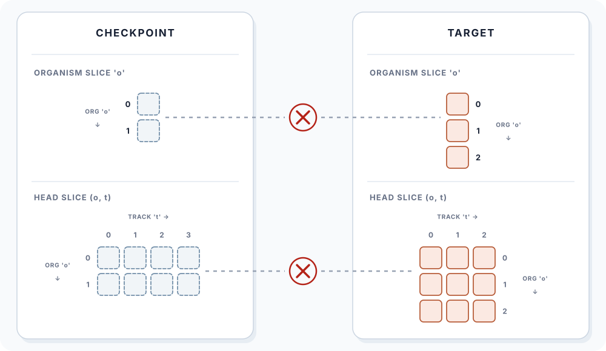
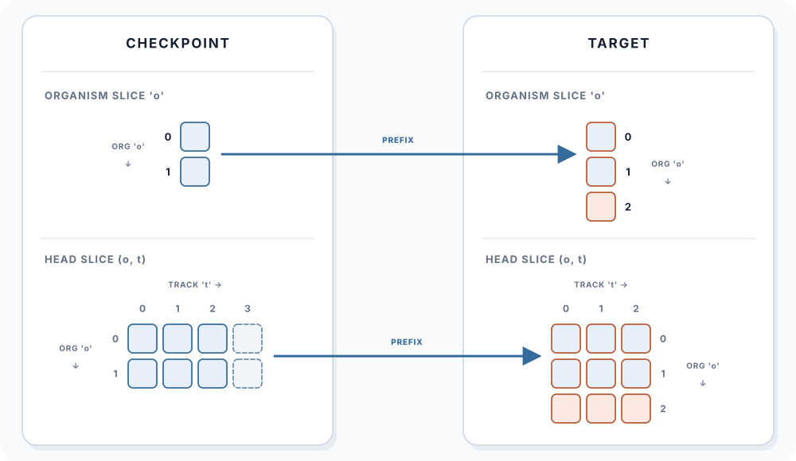
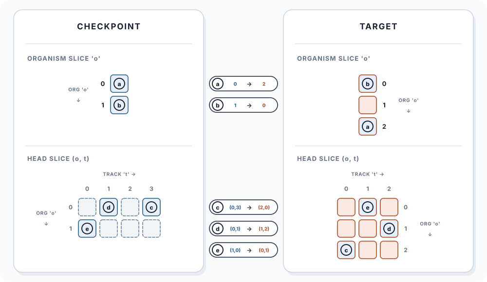

# DeepMind Checkpoints

`deepmind_model(load_state=True)` constructs an `AlphaGenome` model using resolved `metadata` and loads a converted DeepMind checkpoint state.

:::{admonition} Precedence Arrows
:class: note

Throughout this page, arrows show the order in which values are resolved, from
left to right. For example: supplied metadata &rarr; local file &rarr; Hugging
Face.
:::

## Behavior

`deepmind_model()` performs four steps:

| Step | Behavior |
| --- | --- |
| Load Metadata | Supplied `Metadata` or dictionary &rarr; `<local_dir>/alphagenome_metadata.json` &rarr; published AlphaGenome PyTorch metadata from the Hugging Face cache/download. This occurs even when `load_state=False` because metadata determines some model dimensions. |
| Construct Model | Constructs `AlphaGenome` to reproduce the published architecture, with any differences determined by metadata. |
| Load State (optional) | When `load_state=True`, resolves the selected checkpoint from `local_dir` or Hugging Face, deserializes it through `map_location`, and applies one of the three flexible loading schemes below. The default checkpoint is `all_folds`. |
| Return | Moves the completed model to `device` and returns it. |

:::{dropdown} Checkpoint Download Size
:color: warning
:icon: alert

Each published checkpoint is roughly 1.8 GB. With `load_state=True`, a selected
checkpoint that is not already available locally or in the Hugging Face cache
is downloaded before loading.
:::


## Arguments

See [Flexible Loading](#flexible-loading) for the organism and head arguments.

:::{div} long-table
| Argument | Default | Behavior |
| --- | --- | --- |
| `device` | `"cpu"` | Final device receiving the model. |
| `metadata` | `None` | Supplied value &rarr; `local_dir` &rarr; Hugging Face cache/download. |
| `dtype_policy` | `"deepmind"` | Runtime precision policy (see [Precision and Dtype Policies](configuration.md#precision-and-dtype-policies) for options and behavior). |
| `load_state` | `False` | `False`: skip state loading. `True`: resolve state (`local_dir` &rarr; Hugging Face cache/download), then apply flexible loading. |
| `local_dir` | `None` | `None`: Hugging Face cache/download. Supplied: local directory for metadata and state. In either location, reuse an existing file &rarr; download if missing. |
| `local_filename` | `None` | Local state filename: supplied value &rarr; `alphagenome_<fold>.pt`. |
| `organisms` | `True` | `True`: load standalone organism tensors using prefix loading or `organism_spec`. `False`: retain their initialization and ignore `organism_spec`. |
| `organism_spec` | `None` | `None`: prefix loading. Supplied map: explicit source-to-target organism mapping. |
| `heads` | `True` | `True`: load prediction-head state using prefix loading or `head_specs`. `False`: retain their initialization and ignore `head_specs`. |
| `head_specs` | `None` | `None`: load every compatible head by prefix. `{}`: load no heads. Named entries: load only those heads by prefix or explicit mapping. |
| `fold` | `"all_folds"` | Published checkpoint fold: `all_folds` or `fold_0` through `fold_3`. Determines the Hugging Face filename and default local filename. |
| `repo_id` | `"RylieWeaver/alphagenome-pytorch"` | Hugging Face repository used for metadata and state downloads. |
| `repo_dir` | `None` | Repository subdirectory: supplied value &rarr; `v{package-version}`. |
| `token` | `None` | `None`: use `huggingface_hub` defaults. String: use the supplied token. `True`: require a configured token. `False`: disable authentication. |
| `force_download` | `False` | `False`: follow normal file reuse. `True`: download fresh Hugging Face files. |
| `map_location` | `"cpu"` | Device used to deserialize checkpoint tensors before loading. |
| `assign` | `True` | `True`: assign checkpoint tensors, potentially replacing parameter objects. `False`: copy values into existing tensors. |
:::

### Resolved File Paths

| Artifact | Hugging Face Source | Final Path with `local_dir` |
| --- | --- | --- |
| Metadata | `<repo_id>/<repo_dir>/alphagenome_metadata.json` | `<local_dir>/alphagenome_metadata.json` |
| State | `<repo_id>/<repo_dir>/alphagenome_<fold>.pt` | `<local_dir>/<local_filename>` |

An explicit `local_filename` without `local_dir` instead resolves to `<current-working-directory>/<local_filename>`.


## Flexible Loading

Fine-tuning often changes the organisms or outputs defined by [metadata](../background/data-and-metadata.md#metadata). Because AlphaGenome has [parameters specific to those axes](../background/model-architecture.md#organism-specific-parameters-and-state), flexible loading determines which checkpoint slices initialize the new model. The following loading schemes are offered:

| Scheme | Arguments | Behavior |
| --- | --- | --- |
| Skip Loading | `organisms=False` and/or `heads=False` | Retains the initialization for the skipped groups. |
| Prefix Loading | `organisms=True, organism_spec=None` and/or `heads=True` with `head_specs=None` or named `HeadLoadSpec()` entries | Copies overlapping organism and output prefixes. |
| Explicit Mapping | `organisms=True` with an index map in `organism_spec` and/or `heads=True` with index maps in `head_specs` | Copies selected source slices into specified target indices. |

:::{important}
The organism and head choices are independent and can be mixed. `organisms` controls standalone organism tensors, while `heads` controls all prediction-head tensors, including organism-indexed tensors inside the heads.
:::

The diagrams below use this visual key:


### 1. Skip Loading

`organisms=False` skips organism tensors and `heads=False` skips prediction-head tensors.

```{code-block} python
from alphagenome_pt import deepmind_model

model = deepmind_model(
    metadata=metadata,
    load_state=True,
    organisms=False,
    heads=False,
)
```

Shared model state outside the skipped groups is still loaded.



*Figure 1. Skipped organism and head groups retain their model initialization.*

### 2. Prefix Loading

`organisms=True` with `organism_spec=None` loads organism tensors by prefix and `heads=True` with `head_specs=None` loads prediction-head tensors by prefix:

```{code-block} python
model = deepmind_model(
    metadata=metadata,
    load_state=True,
    organisms=True,
    heads=True,
)
```

Prefix loading copies the leading overlap on each axis, leaving excess source slices unused and excess target slices at their initialization.



*Figure 2. Default prefix loading copies the shared organism and output prefixes.*

### 3. Explicit Mapping

`organisms=True` with an index map in `organism_spec` loads organism tensors by explicit mapping and `heads=True` with index maps in `head_specs` loads prediction-head tensors by explicit mapping:

```{code-block} python
model = deepmind_model(
    metadata=metadata,
    load_state=True,
    organism_spec={
        0: 2,
        1: 0,
    },
    head_specs={
        "rna_seq": {
            (0, 3): (2, 0),
            (0, 1): (1, 2),
            (1, 0): (0, 1),
        },
    },
)
```

Explicit mapping copies each listed source slice to its target index, leaving unlisted source slices unused and unmapped target slices at their initialization.

In `organism_spec`, entries map `source_o: target_o`. In each head spec, entries map `(source_o, source_t): (target_o, target_t)`. A supplied `head_specs` selects only its named heads. Explicit index maps must be nonempty, use in-range indices, and assign each target slice at most once.

:::{dropdown} Select a Head While Keeping Prefix Loading
Use `HeadLoadSpec()` for a named head that should use prefix loading:

```{code-block} python
from alphagenome_pt import HeadLoadSpec, deepmind_model

model = deepmind_model(
    metadata=metadata,
    load_state=True,
    head_specs={
        "rna_seq": HeadLoadSpec(),
    },
)
```
:::



*Figure 3. Explicit maps select and reorder organism and head slices.*
